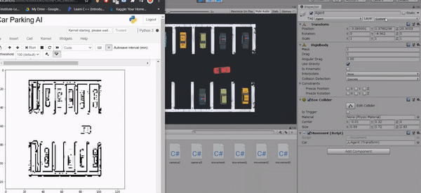
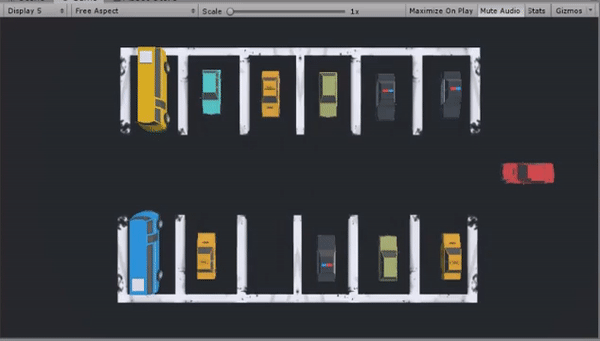

# AI learns to park

## Overview

An AI learns to park a car in a 3D physics simulation. It is trained with Rainbow-DQN algorithm with few modifications.

The input of the Neural Network are the camera images of Display 5. The outputs of the Neural Network are interpreted as engine force, braking force and turning force (continuous values). The AI starts off with random behaviour, i.e. the Neural Network is initialized with random weights. It then gradually learns to solve the task by reacting to environment feedback accordingly.

## Features

#### Manual Mode
The car can be teleoperated using keyboard. Press W, A, S, D to move forward, left, backward and right respectively. To switch to manual mode: uncomment **Manual Mode** in `movement.cs`, comment **Auto Mode** in `movement.cs`, uncheck `camera.cs` in Unity

#### Simple Streaming
Simple video streaming from Unity simulation to perform cv2 operation in Python. To stream: run `simple_streaming.py`

#### Single/Multi Agent
It is compatible with both single and multi(asychronous) agents

#### Save/Load Model
It uses a normal TCP socket. The connection established between the client and the server is not robust. Since, the AI model takes a lot of hours to train, this feature was introduced to save and load the model anytime. The model gets saved automatically. To load the model: set `load=True` in `main.py`

#### Visualize Result
Plot rewards and losses in real-time based on matplotlib. To plot: uncomment `plot(counter, all_rewards, losses)` in `main.py`

## Future Works
- Add connection protocols to improve the connection between client and server.
- Implement better Reinforcement Learning algorithms to reduce training time and accuracy.

## Credits
- **Samuel Arzt**: <a href="https://www.youtube.com/watch?v=VMp6pq6_QjI">AI Learns to Park - Deep Reinforcement Learning</a>
- **higgsfield**: <a href="https://github.com/higgsfield/RL-Adventure">RL-Adventure</a>
